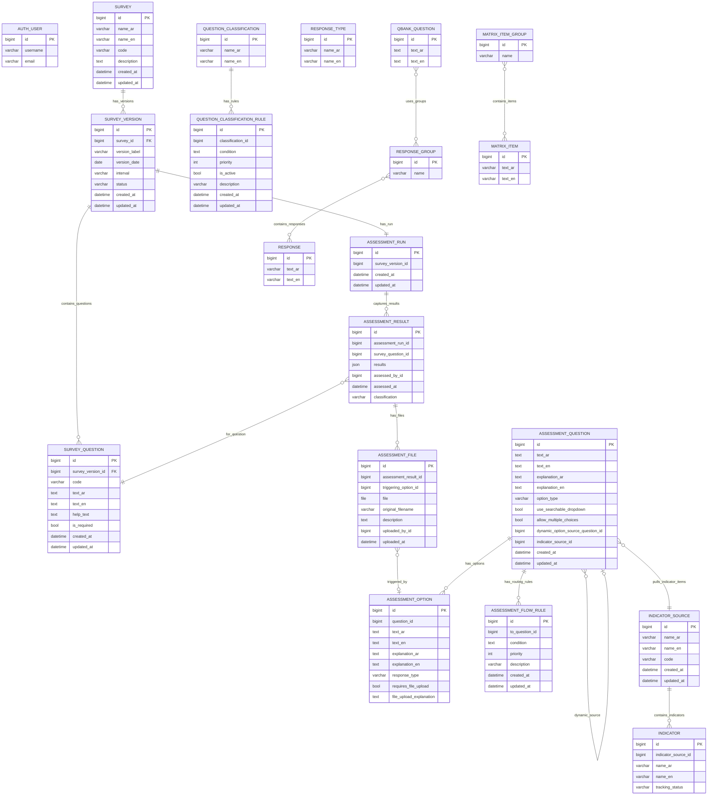

## QuestionsBank

QuestionsBank is an application for authoring survey waves, building assessment flows that review those surveys, and attaching indicators and reusable response banks.

### Data model



### Rule JSON used by routing and classification

Both engines expect a lightweight JSON payload shaped as:

```json
{
  "logic": "AND",
  "conditions": [
    {"question": 123, "operator": "==", "value": "Yes", "type": "value"}
  ],
  "fallback": false
}
```

- `logic` defaults to `"AND"`; use `"OR"` to short-circuit when any condition matches.
- Each condition needs a `question` (SurveyQuestion ID), an `operator` (`==`, `!=`, `>`, `>=`, `<`, `<=`, `in`, `not in`, `contains`, `regex`), and a `value`. Add `"type": "count"` to compare the length of a multi-select answer.
- Set `"fallback": true` to create a default rule that applies when nothing else matched.
- A shorthand single-condition form is also accepted: `{"question": 123, "operator": "==", "value": "Yes"}` is automatically wrapped into the full structure.

### Future data structure improvements

- Introduce a master labels table (with Arabic/English columns) for shared enums like statuses, option types, and tracking values to keep translations consistent across apps.
- Link `QuestionClassificationRule` directly to `SurveyQuestion` for referential integrity and easier rule targeting while still allowing fallbacks.
- Store routing and classification rule versions with a `version`/`effective_from` column so changes can be audited alongside survey versions.
