## QuestionsBank

QuestionsBank is a Django application for authoring survey waves, building assessment flows that review those surveys, and attaching indicator metadata and reusable response banks. It ships with Arabic/English copy and a plain JavaScript frontend.

### Quickstart

1. **Prerequisites:** Python 3.10+, pip, and virtualenv.
2. **Install dependencies:**
   ```bash
   python -m venv .venv && source .venv/bin/activate
   pip install -r requirements.txt
   ```
3. **Database & migrations:** Uses SQLite by default (`db.sqlite3`). Apply migrations:
   ```bash
   python manage.py migrate
   ```
4. **Run the app:**
   ```bash
   python manage.py runserver
   ```
5. **Tests:** After installing dependencies, run:
   ```bash
   python manage.py test
   ```

### Data model (detailed ERD with columns)

```mermaid
erDiagram
    AUTH_USER {
        bigint id PK
        varchar username
        varchar email
        varchar password
        datetime date_joined
        datetime last_login
    }

    SURVEY {
        bigint id PK
        varchar(255) name_ar UK "Survey name (Arabic)"
        varchar(255) name_en UK "Survey name (English)"
        varchar(50) code UK "Unique survey code"
        text description "Survey description"
        varchar(20) status "DRAFT, ACTIVE, ARCHIVED"
        bigint owner_id FK "References AUTH_USER"
        datetime created_at
        datetime updated_at
    }

    SURVEY_EDITORS {
        bigint id PK
        bigint survey_id FK "References SURVEY"
        bigint user_id FK "References AUTH_USER"
    }

    SURVEY_VERSION {
        bigint id PK
        bigint survey_id FK "References SURVEY"
        varchar(50) version_label "Auto-generated label"
        date version_date "Reference date for version"
        varchar(20) interval "M, Q, B, A (Monthly, Quarterly, etc.)"
        varchar(20) status "DRAFT, ACTIVE, LOCKED, ARCHIVED"
        datetime created_at
        datetime updated_at
    }

    SURVEY_QUESTION {
        bigint id PK
        bigint survey_version_id FK "References SURVEY_VERSION"
        varchar(50) code "Optional question code"
        text text_ar "Question text (Arabic)"
        text text_en "Question text (English)"
        text help_text "Help text for data collector"
        varchar(255) section_label "Logical section label"
        bool is_required "Must be answered during collection"
        datetime created_at
        datetime updated_at
    }

    ASSESSMENT_QUESTION {
        bigint id PK
        varchar(512) text_ar "Question text (Arabic)"
        varchar(512) text_en "Question text (English)"
        text explanation_ar "Explanation (Arabic)"
        text explanation_en "Explanation (English)"
        varchar(50) option_type "STATIC, DYNAMIC_FROM_PREVIOUS_MULTI_SELECT, DYNAMIC_SURVEY_QUESTIONS, INDICATOR_LIST"
        bool use_searchable_dropdown "Enable searchable dropdown UI"
        bool allow_multiple_choices "Allow multiple selections"
        bigint dynamic_option_source_question_id FK "References ASSESSMENT_QUESTION (self)"
        bigint indicator_source_id FK "References INDICATOR"
        datetime created_at
        datetime updated_at
    }

    ASSESSMENT_OPTION {
        bigint id PK
        bigint question_id FK "References ASSESSMENT_QUESTION"
        text text_ar "Option text (Arabic)"
        text text_en "Option text (English)"
        text explanation_ar "Explanation (Arabic)"
        text explanation_en "Explanation (English)"
        varchar(20) response_type "PREDEFINED, FREE_TEXT, NUMERICAL, URL"
        bool requires_file_upload "Requires file upload"
        text file_upload_explanation "File upload instructions"
    }

    ASSESSMENT_FLOW_RULE {
        bigint id PK
        bigint from_question_id FK "References ASSESSMENT_QUESTION"
        text condition "Routing logic expression"
        int priority "Rule evaluation order"
        bool is_active "Rule enabled/disabled"
        varchar(255) description "Human-readable description"
        datetime created_at
        datetime updated_at
    }

    ASSESSMENT_RUN {
        bigint id PK
        bigint survey_version_id FK "References SURVEY_VERSION"
        varchar(100) label "Run label/identifier"
        varchar(20) status "DRAFT, IN_PROGRESS, COMPLETE, CANCELLED"
        bigint created_by_id FK "References AUTH_USER"
        bigint assigned_to_id FK "References AUTH_USER"
        datetime started_at "Run start timestamp"
        datetime completed_at "Run completion timestamp"
        text notes "Run notes"
        datetime created_at
        datetime updated_at
    }

    ASSESSMENT_RESULT {
        bigint id PK
        bigint assessment_run_id FK "References ASSESSMENT_RUN"
        bigint survey_question_id FK "References SURVEY_QUESTION"
        varchar(20) status "NOT_VISITED, IN_PROGRESS, COMPLETE, PENDING_UPLOAD"
        bigint assessed_by_id FK "References AUTH_USER"
        json assessment_path "Navigation path through assessment"
        text summary_comment "Assessor's summary comment"
        json flags "Additional flags/metadata"
        datetime assessed_at "Last assessment timestamp"
    }

    ASSESSMENT_FILE {
        bigint id PK
        bigint assessment_result_id FK "References ASSESSMENT_RESULT"
        bigint triggering_option_id FK "References ASSESSMENT_OPTION"
        file file "Uploaded file path"
        varchar(255) original_filename "Original filename"
        text description "File description"
        bigint uploaded_by_id FK "References AUTH_USER"
        datetime uploaded_at
    }

    QUESTION_CLASSIFICATION_RULE {
        bigint id PK
        bigint survey_question_id FK "References SURVEY_QUESTION"
        varchar(100) classification "Classification label"
        text condition "Classification logic (JSON)"
        int priority "Rule evaluation order"
        bool is_active "Rule enabled/disabled"
        varchar(255) description "Human-readable description"
        datetime created_at
        datetime updated_at
    }

    REEVALUATION_QUESTION {
        bigint id PK
        bigint survey_version_id FK "References SURVEY_VERSION"
        varchar(512) text_ar "Question text (Arabic)"
        varchar(512) text_en "Question text (English)"
        datetime created_at
        datetime updated_at
    }

    INDICATOR {
        bigint id PK
        varchar(255) name_ar UK "Indicator name (Arabic)"
        varchar(255) name_en UK "Indicator name (English)"
        varchar(50) code "Indicator code"
        datetime created_at
        datetime updated_at
    }

    INDICATOR_LIST_ITEM {
        bigint id PK
        bigint indicator_id FK "References INDICATOR"
        varchar(255) name "Item name"
        varchar(50) code "Item code"
    }

    INDICATOR_TRACKING {
        bigint id PK
        bigint indicator_list_item_id FK "References INDICATOR_LIST_ITEM"
        varchar(20) status "TRACKED, NOT_TRACKED"
    }

    CLASSIFICATION {
        bigint id PK
        varchar(100) name_ar UK "Classification name (Arabic)"
        varchar(100) name_en UK "Classification name (English)"
    }

    INDICATOR_CLASSIFICATION {
        bigint id PK
        bigint indicator_id FK "References INDICATOR"
        bigint classification_id FK "References CLASSIFICATION"
    }

    CLASSIFICATION_INDICATOR_LIST_ITEM {
        bigint id PK
        bigint classification_id FK "References CLASSIFICATION"
        bigint indicatorlistitem_id FK "References INDICATOR_LIST_ITEM"
    }

    RESPONSE_TYPE {
        bigint id PK
        varchar(100) name_ar UK "Response type (Arabic)"
        varchar(100) name_en UK "Response type (English)"
    }

    RESPONSE {
        bigint id PK
        varchar(255) text_ar "Response text (Arabic)"
        varchar(255) text_en "Response text (English)"
    }

    RESPONSE_GROUP {
        bigint id PK
        varchar(255) name "Group name"
    }

    RESPONSE_GROUP_RESPONSES {
        bigint id PK
        bigint responsegroup_id FK "References RESPONSE_GROUP"
        bigint response_id FK "References RESPONSE"
    }

    QNR_SURVEY_QUESTION {
        bigint id PK
        text text_ar "Question text (Arabic)"
        text text_en "Question text (English)"
    }

    QNR_SURVEY_QUESTION_RESPONSE_GROUPS {
        bigint id PK
        bigint surveyquestion_id FK "References QNR_SURVEY_QUESTION"
        bigint responsegroup_id FK "References RESPONSE_GROUP"
    }

    MATRIX_ITEM {
        bigint id PK
        varchar(255) text_ar "Item text (Arabic)"
        varchar(255) text_en "Item text (English)"
    }

    MATRIX_ITEM_GROUP {
        bigint id PK
        varchar(255) name "Group name"
    }

    MATRIX_ITEM_GROUP_ITEMS {
        bigint id PK
        bigint matrixitemgroup_id FK "References MATRIX_ITEM_GROUP"
        bigint matrixitem_id FK "References MATRIX_ITEM"
    }

    SURVEY ||--o{ SURVEY_VERSION : "has versions"
    SURVEY }o--|| AUTH_USER : "owned by"
    SURVEY }o--o{ AUTH_USER : "edited by (via SURVEY_EDITORS)"
    SURVEY_VERSION ||--o{ SURVEY_QUESTION : "contains questions"
    SURVEY_VERSION ||--o{ ASSESSMENT_RUN : "assessed by"
    SURVEY_VERSION ||--o{ REEVALUATION_QUESTION : "has reevaluation questions"
    ASSESSMENT_RUN ||--o{ ASSESSMENT_RESULT : "produces results"
    ASSESSMENT_RUN }o--|| AUTH_USER : "created by"
    ASSESSMENT_RUN }o--o| AUTH_USER : "assigned to"
    ASSESSMENT_RESULT }o--|| SURVEY_QUESTION : "assesses"
    ASSESSMENT_RESULT }o--|| ASSESSMENT_RUN : "belongs to"
    ASSESSMENT_RESULT }o--o| AUTH_USER : "assessed by"
    ASSESSMENT_RESULT ||--o{ ASSESSMENT_FILE : "has uploaded files"
    ASSESSMENT_FILE }o--o| ASSESSMENT_OPTION : "triggered by option"
    ASSESSMENT_FILE }o--o| AUTH_USER : "uploaded by"
    ASSESSMENT_QUESTION ||--o{ ASSESSMENT_OPTION : "has options"
    ASSESSMENT_QUESTION ||--o{ ASSESSMENT_FLOW_RULE : "has routing rules"
    ASSESSMENT_QUESTION }o--o| ASSESSMENT_QUESTION : "dynamic source (self-reference)"
    ASSESSMENT_QUESTION }o--o| INDICATOR : "pulls indicator list"
    INDICATOR ||--o{ INDICATOR_LIST_ITEM : "contains items"
    INDICATOR_LIST_ITEM ||--o{ INDICATOR_TRACKING : "has tracking status"
    INDICATOR ||--o{ INDICATOR_CLASSIFICATION : "tagged with"
    CLASSIFICATION ||--o{ INDICATOR_CLASSIFICATION : "classifies indicators"
    INDICATOR_LIST_ITEM ||--o{ CLASSIFICATION_INDICATOR_LIST_ITEM : "classified by"
    CLASSIFICATION ||--o{ CLASSIFICATION_INDICATOR_LIST_ITEM : "classifies items"
    SURVEY_QUESTION ||--o{ QUESTION_CLASSIFICATION_RULE : "has classification rules"
    RESPONSE_GROUP ||--o{ RESPONSE : "contains responses (via RESPONSE_GROUP_RESPONSES)"
    QNR_SURVEY_QUESTION ||--o{ RESPONSE_GROUP : "uses groups (via QNR_SURVEY_QUESTION_RESPONSE_GROUPS)"
    MATRIX_ITEM_GROUP ||--o{ MATRIX_ITEM : "contains items (via MATRIX_ITEM_GROUP_ITEMS)"
```



*Notes:*
- **Field types & constraints:** The ERD now includes precise field types (e.g., `varchar(255)`, `text`, `bool`, `json`, `file`, `date`, `datetime`) with unique constraints (UK) and foreign keys (FK) explicitly marked.
- **Many-to-Many relationships:** M2M relationships are shown via intermediate junction tables (`SURVEY_EDITORS`, `RESPONSE_GROUP_RESPONSES`, `QNR_SURVEY_QUESTION_RESPONSE_GROUPS`, `MATRIX_ITEM_GROUP_ITEMS`) to clarify the actual database structure.
- **SURVEY_QUESTION** refers to `surveys.SurveyQuestion` (per survey version). Progress is stored against these questions even though navigation is handled by `AssessmentQuestion` nodes, keeping outcomes aligned with the canonical survey content being reviewed.
- **QNR_SURVEY_QUESTION**, `RESPONSE_GROUP`, and `RESPONSE` map to the `Qbank` app models (`Qbank.SurveyQuestion`, `Rbank.ResponseGroup`, `Rbank.Response`) used for reusable option banks. `MATRIX_ITEM` and `MATRIX_ITEM_GROUP` from `Qbank` support matrix-style question construction.
- **Uploaded files:** `AssessmentFile` records always point back to the owning `AssessmentResult` and, when available, the triggering `AssessmentOption`. Each file references at most one option, while an option can have many uploaded files.
- **Flow rules:** Hang off a source `AssessmentQuestion` and store option-specific logic inside their `condition` text. Dynamic option types may derive choices from other assessment questions or survey questions at runtime rather than via direct foreign keys.
- **User relationships:** `AUTH_USER` is referenced by `SURVEY` (owner), `SURVEY_EDITORS` (M2M for editors), `ASSESSMENT_RUN` (created_by, assigned_to), `ASSESSMENT_RESULT` (assessed_by), and `ASSESSMENT_FILE` (uploaded_by).
- **Auto-generated fields:** `SURVEY_VERSION.version_label` is auto-generated from survey code, interval, and version date. Unique constraints exist on `(survey, version_label)`, `(indicator, name)`, and `(indicator, classification)`.

### Critical data points

- **Surveys:** `Survey` holds names/codes and ownership; `SurveyVersion` enforces unique labels per survey and autogenerates labels from survey code + version date; `SurveyQuestion` stores bilingual text plus optional codes/section labels.
- **Assessment flows:** `AssessmentQuestion` + `AssessmentOption` define branching nodes; `AssessmentFlowRule` stores declarative routing; `AssessmentRun`/`AssessmentResult` record progress and status per survey question; `AssessmentFile` captures uploads tied to a specific option/result; `QuestionClassificationRule` classifies completed questions; `ReevaluationQuestion` stores prompts for later waves.
- **Indicators:** `Indicator` groups `IndicatorListItem` entries; `IndicatorTracking` marks tracked/not-tracked status; `IndicatorClassification` and `ClassificationIndicatorListItem` relate indicators/items to reusable `Classification` tags.
- **Response bank:** `Response` values are grouped in `ResponseGroup` and attached to `QnR` questions, enabling reusable option sets.

Localization defaults to Arabic (`LANGUAGE_CODE="ar"`), with English available. Timestamps are timezone-aware (`Asia/Riyadh`). Static assets load from `static/` with `base.html` templates.
