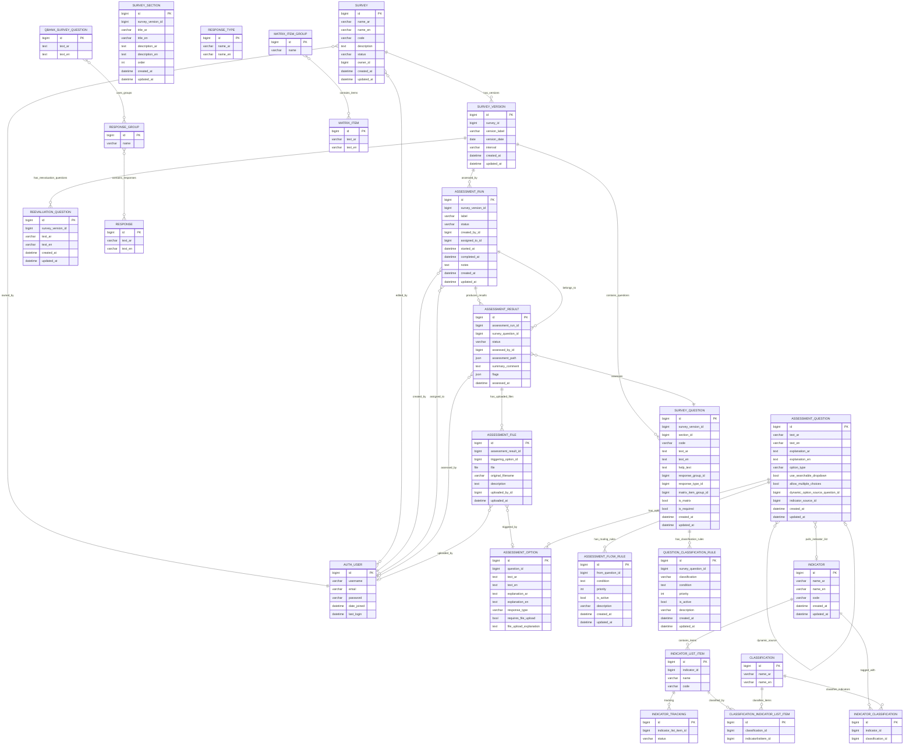

## QuestionsBank

QuestionsBank is an application for authoring survey waves, building assessment flows that review those surveys, and attaching indicators and reusable response banks.

### Data model

